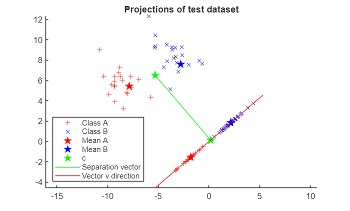
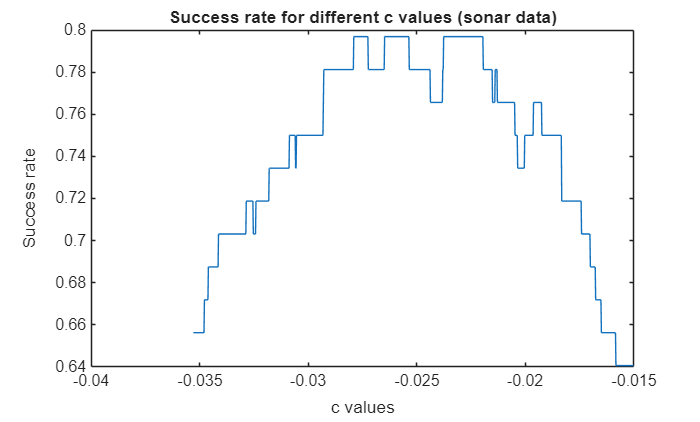

# Fisher's Linear Discriminant Analysis(LDA)

Fisher's Linear Discriminant Analysis (LDA) is a dimensionality reduction and classification technique that projects high\-dimensional data onto a lower\-dimensional space to maximize class separability.

In this project, I implement and analyze Fisher's LDA on both synthetic and real\-world datasets to explore:

-  The theoretical basis of LDA 
-  Its practical performance on benchmark data 
-  The sensitivity of its classification threshold 
# Overview

We try to understand an apply LDA for binary classification, and assess its performance and limitations. We work on three different datasets: a synthetic 2D toy dataset, the sonar and ionosphere datasets from UCI Machine Learning Repository (https://archive.ics.uci.edu).

# Fisher's LDA concept

LDA seeks a projection vector $v$ that maximizes class separation by solving:

 $$ \max_{\|v\|\not= 0} \frac{(v^T m_A -v^T m_B )^2 }{v^T (\Sigma_A +\Sigma_B )v} $$ 

where $m_A ,m_B$ are the mean vectors and $\Sigma_A ,\Sigma_B$ are class covariances.

This projections creates a new 1D feature space where classes are most linearly separable.

## Synthetic example

A 2D toy dataset is generated with two Gaussian\-distributed classes. LDA finds an optimal separating vector $v$, maximizing between\-class distance and minimizing within\-class variance.

**Results**:

Training accuracy: **98.3%**

Test accuracy: **100%** 

The projection clearly separates the two groups along the computed discriminant axis.

## Benchmark Evaluation on UCI datasets

**Sonar dataset** (208 samples, 60 features) accuracy: **78.1%**

**Ionosphere dataset** (351 samples, 34 features) accuracy: **86.9%**

Note that when the covariance matrix became singular, the least squares solution (LSQR) or pseudoinverse (pinv) was used to stabilize inversion.

## Sensitivity analysis

The classification decision rule uses a threshold $c$:

 $$ \textrm{If}\;v^T x>c\Rightarrow \textrm{Class}\;\textrm{A;}\;\textrm{otherwise}\;\textrm{Class}\;\textrm{B} $$ 

By sweeping $c$ between $v^T m_A$ and $v^T m_B$, we observe that accuracy is highly sensitive to the choice of $c$, though the optimal value typically lies near the midpoint:

 $$ c=v^T \frac{\left(m_A +m_B \right)}{2} $$ 

# Key insights
-  LDA works best when classes are approximately linearly separable and covariances are similar 
-  For high\-dimensional data, covariance matrices may be singular. In this case, we may use regularization or pseudoinverse 
-  Proper threshold calibration is crucial for stable results 
-  Simplicity and interpretability make LDA a strong baseline for supervised learning tasks 
