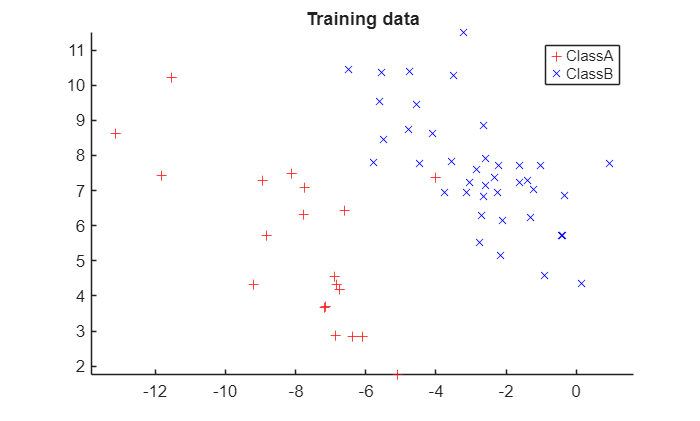
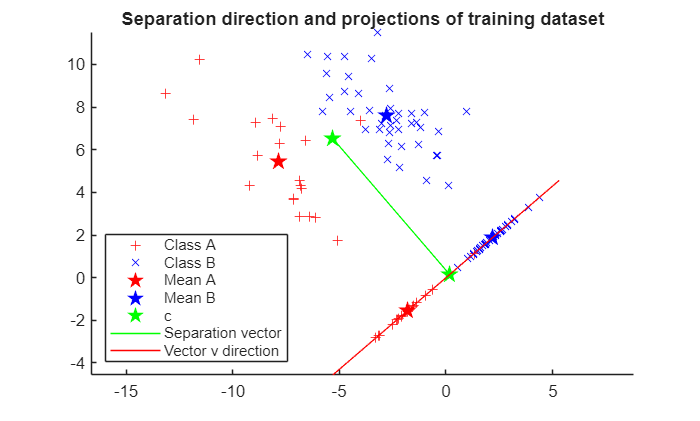
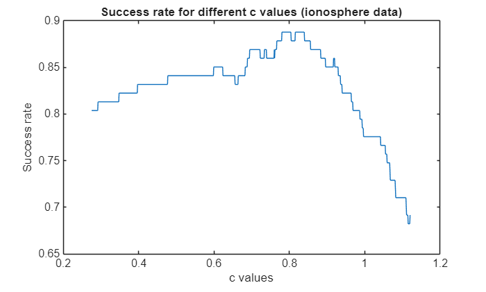

<a id="TMP_9640"></a>

# Fisher's Linear Discriminant Analysis

Fisher's Linear Discriminant Analysis (LDA) is a dimension reduction technique commonly used for supervised classification problems. The goal of LDA is to project features in higher dimension space onto a lower dimensional space, such that samples from different distributions are well separated. In this project, we study the basics of Fisher’s LDA and explore practical issues using several real\-world datasets.

<!-- Begin Toc -->

## Table of Contents
&emsp;[Fisher's LDA via a toy problem](#TMP_2514)
 
&emsp;[UCI Benchmark Problems](#TMP_9e1f)
 
&emsp;&emsp;[Classification](#TMP_4b88)
 
&emsp;&emsp;[Changing c value](#TMP_5c6a)
 
<!-- End Toc -->
<a id="TMP_2514"></a>

# Fisher's LDA via a toy problem

We begin with a toy problem to get an intuition about Fisher's LDA.

<a id="TMP_7708"></a>

**Dataset generation**: The following code produces two classes of data points, labelled A and B, each drawn from a normal distribution (with different mean and covariance). Each data sample is a two\-dimensional vector, and all samples are stored in matrices where each column represents one data point. Here we make two datasets: training and testing. The training data will be used to train the classifier, while the testing data used to assess classification accuracy.

```matlab
clear; 
rng(0);

 % Generate data points
 muA   = [-8;5]; muB = [-3;8];
 theta = pi/4;
 T     = [cos(theta),-sin(theta); sin(theta), cos(theta)];
 S     = T*diag([1,2])*T';
 DataA = S*randn(2, 40) + muA * ones(1,40);
 DataB = S*randn(2, 60) + muB * ones(1,60);
 
 % Training and testing data: each column is a sample
 TrainA = DataA(:,1:end-20);
 TestA  = DataA(:,end-20+1:end);
 TrainB = DataB(:,1:end-20);
 TestB  = DataB(:,end-20+1:end);
 
 % Show data points
 figure(1)
 hold on;
 plot(TrainA(1,:),TrainA(2,:), '+r', 'DisplayName','ClassA');
 plot(TrainB(1,:),TrainB(2,:), 'xb', 'DisplayName','ClassB');
 axis equal; legend show; title('Training data')
```



Fisher's LDA attempts to find a separation vector by solving the optimization problem

 $$ \max_{\|v\|\not= 0} \frac{(v^T m_A -v^T m_B )^2 }{v^T (\Sigma_A +\Sigma_B )v} $$ 

where $m_C$, $\Sigma {\;}_C$ are sampled mean and covariance matrices for $C\in \left\lbrace A,B\right\rbrace$.


According to Fisher's linear discriminant problem, we are looking for the best separation vector $v$ for the classes $A$ and $B$. However, the optimization problem can be written as a generalized Rayleigh quotient as:

 $$ R=\frac{v^T Sv}{v^T Mv}\;\textrm{with}\;S=(m_A -m_B )(m_A -m_B )^T \;\textrm{and}\;M=(\Sigma_A +\Sigma_B ) $$ 

By writing the optimization problem this way, we know it reaches its maximum when $v$ is an eigenvector associated with the largest eigenvalue of $M^{-1} S$ so we have:

 $$ M^{-1} Sv=\lambda v $$ 

In our case: 

 $$ M^{-1} (m_A -m_B )(m_A -m_B )^T v=\lambda v $$ 

As the product ${\left(m_A -m_B \right)}^T v$ is a scalar, $v$ must be proportional to $M^{-1} \left(m_A -m_B \right)$. In conclusion, a vector proportional to $M^{-1} \left(m_A -m_B \right)$ is an eigenvector associated with the largest eigenvalue of $M^{-1} S$, and so, is a solution to the optimization problem. In particular, $M^{-1} \left(m_A -m_B \right)$ is one of them.


Finally, we have shown that an optimal solution is given by:

 $$ v={\left(\Sigma_A +\Sigma_B \right)}^{-1} \left(m_A -m_B \right) $$ 


The separation vector computed from training datasets is illustrated below. As we can see from the figure, the projection of the two classes onto the direction  (the solid line) are well separated. The five\-pointed stars represent mean values.

```matlab
 % Sample mean & covariance
 mA = mean(TrainA')';
 mB = mean(TrainB')';
 sA = cov(TrainA');
 sB = cov(TrainB');

 % Separation vector
 v = (sA+sB)\(mA-mB);
 v = v/norm(v);

 % Show data
 projA  = v*v'*TrainA; projB = v*v'*TrainB;
 projmA = v*v'*mA; projmB = v*v'*mB;
```

**Classification**: Using the computed separation vector $v$ from above, we can classify a sample vector $x$ based on its projection on $v$.


According to the optimization problem definition, we defined $v$ such that the difference between the projection of group $A$ mean and the projection of group $B$ mean is maximized. This maximization is penalized proportionally to the sum of the within\-class covariance matrices. If data is not too sparse, group $A$ points should be projected around group $A$ mean projection without overlapping projection of group $B$. This means that we can suppose there is a $c$ such that, if $v^T x>c$ then we can guess $x$ belongs to class $A$, otherwise, to class $B$.


A natural (default) choice of the thresholding constant is $c=v^T \frac{\left(m_A +m_B \right)}{2}$, in which case the class of $x$ is assigned to the one with projected sample mean closer to $v^T x$.

```matlab
c = (mA+mB)/2;
proj_of_c = v*v.'*c;

figure(2)
hold on;
plot([TrainA(1,:),projA(1,:)], [TrainA(2,:),projA(2,:)], '+r', 'DisplayName', 'Class A');
plot([TrainB(1,:),projB(1,:)], [TrainB(2,:),projB(2,:)], 'xb', 'DisplayName', 'Class B');
plot([mA(1),projmA(1)],[mA(2),projmA(2)],'pr','MarkerFaceColor','red','Markersize',10, 'DisplayName', 'Mean A');
plot([mB(1),projmB(1)],[mB(2),projmB(2)],'pb','MarkerFaceColor','blue','Markersize',10, 'DisplayName', 'Mean B');

plot([c(1),proj_of_c(1)],[c(2),proj_of_c(2)],'pg','MarkerFaceColor','green','Markersize',10, 'DisplayName', 'c');
plot([c(1),proj_of_c(1)], [c(2),proj_of_c(2)], '-green', 'DisplayName', 'Separation vector');

plot(7*[-v(1),v(1)], 7*[-v(2),v(2)], '-r', 'DisplayName', 'Vector v direction');

axis equal;
legend('Location','southwest');
title('Separation direction and projections of training dataset')
```



```matlab
function labels = classify(data, v, c_proj)
    data_projection = v.'*data;
    labels          = data_projection < c_proj;
end

% Test the classification
classify(TrainA, v, v.'*c)
```

```matlabTextOutput
ans = 1x20 logical array
   0   0   0   0   1   0   0   0   0   0   0   0   0   0   0   0   0   0   0   0

```

```matlab
function success_rate = report_success_rate(test_set_0, test_set_1, v, c)
    labels_0 = classify(test_set_0,v, c);
    labels_1 = classify(test_set_1,v, c);

    miss_0 = sum(labels_0(:) == 1);
    miss_1 = sum(labels_1(:) == 0);

    success_rate = 1 - (miss_0 + miss_1)/(size(test_set_0,2) + size(test_set_1,2));

end

% Compute sucess rate
report_success_rate(TrainA, TrainB, v, v.'*c)
```

```matlabTextOutput
ans = 0.9833
```

```matlab
report_success_rate(TestA, TestB, v, v.'*c)
```

```matlabTextOutput
ans = 1
```

```matlab
figure(3)
hold on;
plot([TestA(1,:),projA(1,:)], [TestA(2,:),projA(2,:)], '+r', 'DisplayName', 'Class A');
plot([TestB(1,:),projB(1,:)], [TestB(2,:),projB(2,:)], 'xb', 'DisplayName', 'Class B');
plot([mA(1),projmA(1)],[mA(2),projmA(2)],'pr','MarkerFaceColor','red','Markersize',10, 'DisplayName', 'Mean A');
plot([mB(1),projmB(1)],[mB(2),projmB(2)],'pb','MarkerFaceColor','blue','Markersize',10, 'DisplayName', 'Mean B');

plot([c(1),proj_of_c(1)],[c(2),proj_of_c(2)],'pg','MarkerFaceColor','green','Markersize',10, 'DisplayName', 'c');
plot([c(1),proj_of_c(1)], [c(2),proj_of_c(2)], '-green', 'DisplayName', 'Separation vector');

plot(7*[-v(1),v(1)], 7*[-v(2),v(2)], '-r', 'DisplayName', 'Vector v direction');

axis equal;
legend('Location','southwest');
title('Projections of test dataset')
```


Fisher's Linear Discriminant method seems to work well on this toy dataset as the success rate is 1 on the test set (no points misclassified).

<a id="TMP_9e1f"></a>

# UCI Benchmark Problems

To demonstrate the effectiveness of LDA in real\-life data, let us consider application to the sonar and ionosphere datasets from UCI Machine Learning Repository (https://archive.ics.uci.edu). The data matrices can be directly loaded as below. For each case, you will get two matrices: a data matrix containing sample data (each row is a feature vector); a label matrix with 0\-1 element representing the class of each row in the data matrix.

```matlab
clear;
```

The 'sonar' example:

```matlab
load data/sonar.mat
whos('-file','data/sonar.mat')
```

```matlabTextOutput
  Name               Size            Bytes  Class      Attributes

  sonar_data       208x60            99840  double               
  sonar_label      208x1               208  logical              
```


The 'ionosphere' example:

<a id="TMP_66ef"></a>
```matlab
load data/ionosphere.mat
whos('-file','data/ionosphere.mat');
```

```matlabTextOutput
  Name                    Size            Bytes  Class      Attributes

  ionosphere_data       351x34            95472  double               
  ionosphere_label      351x1               351  logical              
```

<a id="TMP_4b88"></a>

## Classification
```matlab
% Start by sort data by labels (to keep balanced datasets)
sonar_data_0 = sonar_data(find(sonar_label(:,1)==0),:);
sonar_data_1 = sonar_data(find(sonar_label(:,1)==1),:);

% Create training datasets
train_sonar_0 = sonar_data_0(1:round(0.7*size(sonar_data_0,1)), :);
train_sonar_1 = sonar_data_1(1:round(0.7*size(sonar_data_1,1)), :);
% Create test datasets
test_sonar_0 = sonar_data_0(round(0.7*size(sonar_data_0,1)):size(sonar_data_0,1), :);
test_sonar_1 = sonar_data_1(round(0.7*size(sonar_data_1,1)):size(sonar_data_1,1), :);

% Sample mean & covariance
m_sonar_0 = mean(train_sonar_0).';
m_sonar_1 = mean(train_sonar_1).';
s_sonar_0 = cov(train_sonar_0);
s_sonar_1 = cov(train_sonar_1);

% Separation vector v
v_sonar = (s_sonar_0+s_sonar_1)\(m_sonar_0-m_sonar_1);
v_sonar = v_sonar/norm(v_sonar);

% Center c
c_sonar = (m_sonar_0+m_sonar_1)/2;

% Compute sucess rate
report_success_rate(test_sonar_0.', test_sonar_1.', v_sonar, v_sonar.'*c_sonar)
```

```matlabTextOutput
ans = 0.7812
```

```matlab
% Start by sort data by labels (to keep balanced datasets)
iono_data_0 = ionosphere_data(find(ionosphere_label(:,1)==0),:);
iono_data_1 = ionosphere_data(find(ionosphere_label(:,1)==1),:);

% Create training datasets
train_iono_0 = iono_data_0(1:round(0.7*size(iono_data_0,1)), :);
train_iono_1 = iono_data_1(1:round(0.7*size(iono_data_1,1)), :);
% Create test datasets
test_iono_0 = iono_data_0(round(0.7*size(iono_data_0,1)):size(iono_data_0,1), :);
test_iono_1 = iono_data_1(round(0.7*size(iono_data_1,1)):size(iono_data_1,1), :);

% Sample mean & covariance
m_iono_0 = mean(train_iono_0).';
m_iono_1 = mean(train_iono_1).';
s_iono_0 = cov(train_iono_0);
s_iono_1 = cov(train_iono_1);

% Separation vector v
v_iono = lsqr(s_iono_0+s_iono_1, m_iono_0-m_iono_1);
```

```matlabTextOutput
lsqr stopped at iteration 20 without converging to the desired tolerance 1e-06
because the maximum number of iterations was reached.
The iterate returned (number 20) has relative residual 0.056.
```


For ionosphere data, $M=\Sigma_A +\Sigma_B$ become singular due to the high number of $0$ coefficient. According to Matlab documentation, the least\-squares method is recommended for handling sparse matrices such as $M$ in this case. With the same method as in sonar data study, we obtain a warning as we try to invert a singular matrix. To address this issue, we could also have tried to keep the same method and use the pseudoinverse with the *pinv* function. Principal components analysis also can be applied to reduce dimensionality and improve matrix invertibility.

```matlab
v_iono = v_iono/norm(v_iono);

% Center c
c_iono = (m_iono_0+m_iono_1)/2;

% Compute sucess rate
report_success_rate(test_iono_0.', test_iono_1.', v_iono, v_iono.'*c_iono)
```

```matlabTextOutput
ans = 0.8692
```


According to the success rates results, the Fisher's Linear Discriminant Analysis seems to be slightly more adapted for the ionosphere dataset. However, we can consider both success rates as good results.

<a id="TMP_5c6a"></a>

## Changing c value

To analyze the optimal choice of $c$ we plot the success rate as a function of $c$ ranging between $v^T m_A$ and $v^T m_B$ for each dataset. For both, the best $c$ values are near the center of the segment as chosen by intuition in the first part. However, the fluctuation of the success rate is highly sensitive to the value of $c$, and even small changes can lead to significantly different results.

```matlab
% For sonar data
c_sonar_values = linspace(v_sonar.'*m_sonar_0, v_sonar.'*m_sonar_1, 1000);
sonar_success_rates=[];

for c_sonar = c_sonar_values
    sonar_success_rates = [sonar_success_rates report_success_rate(test_sonar_0.', test_sonar_1.', v_sonar, c_sonar)];
end

% For iono data
c_iono_values = linspace(v_iono.'*m_iono_0, v_iono.'*m_iono_1, 1000);
iono_success_rates=[];

for c_iono = c_iono_values
    iono_success_rates = [iono_success_rates report_success_rate(test_iono_0.', test_iono_1.', v_iono, c_iono)];
end

% Plots
figure(4)
plot(c_sonar_values, sonar_success_rates)
title('Success rate for different c values (sonar data)')
ylabel('Success rate')
xlabel('c values')
```


```matlab
figure(5)
plot(c_iono_values, iono_success_rates)
title('Success rate for different c values (ionosphere data)')
ylabel('Success rate')
xlabel('c values')
```


